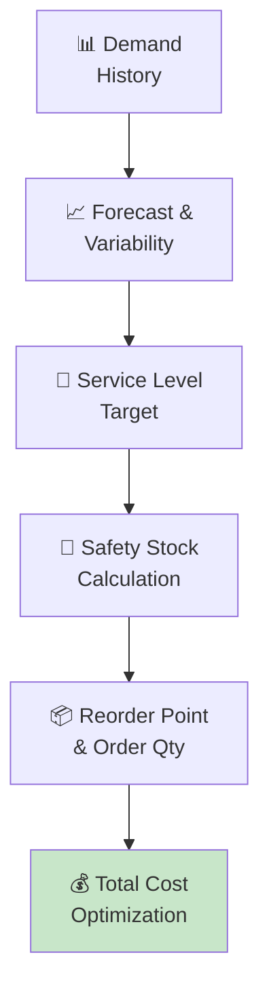

# 📦 Safety Stock Calculator

<p align="center">
  
  
  
  
</p>


*Balancing service levels against carrying costs for optimal inventory positioning*

---

## 📋 Overview

**Safety Stock Calculator** addresses a critical challenge in modern supply chain management: inventory management. This implementation combines rigorous academic methodology with production-ready Python code, suitable for both research and enterprise deployment.

Built on the foundational work of **Professor Edward Silver**, this tool provides supply chain professionals with an analytical framework that transforms raw operational data into actionable optimization decisions. Whether you're managing a single warehouse or a global multi-echelon network, this toolkit scales to your complexity.

The solution follows industry best practices from APICS/ASCM, CSCMP, and ISM frameworks, implemented with clean, extensible Python code that integrates with existing ERP, WMS, and TMS systems.

**Key capabilities:**
- Service level-driven safety stock calculation (z-score based)
- Reorder point and order quantity optimization
- ABC classification with Pareto analysis
- Holding cost vs. stockout cost trade-off analysis
- Multi-location inventory positioning

---

## 🏗️ Architecture



---

## ❗ Problem Statement

### The Challenge

Supply chain inventory management is a persistent operational challenge that impacts cost, service, and working capital across the enterprise. Organizations that fail to optimize inventory management typically see:

| Impact Area | Without Optimization | With Optimization | Improvement |
|-------------|---------------------|-------------------|-------------|
| **Cost** | Baseline | 15-30% reduction | Significant |
| **Service Level** | 85-90% | 95-99% | +5-14 pts |
| **Working Capital** | Over-invested | Right-sized | 20-40% freed |
| **Decision Speed** | Days/weeks | Minutes/hours | 10-50x faster |

> *"The goal is not to optimize individual functions, but to optimize the entire supply chain system — which often means sub-optimizing individual nodes for the benefit of the whole."*

---

## ✅ Solution Methodology

### Methodology

This implementation follows a structured analytical approach:

1. **Data Ingestion & Validation** — Load operational data, validate completeness, handle missing values and outliers
2. **Exploratory Analysis** — Statistical profiling, distribution analysis, correlation identification
3. **Model Construction** — Build the optimization/analytical model with configurable parameters and constraints
4. **Solution Computation** — Execute the algorithm with convergence checking and solution quality metrics
5. **Results & Recommendations** — Generate actionable outputs with sensitivity analysis and implementation guidance

---

## 💻 Quick Start

### Prerequisites

| Requirement | Version |
|-------------|---------|
| Python | 3.8+ |
| pip | Latest |

### Installation

```bash
git clone https://github.com/virbahu/safety-stock-calculator.git
cd safety-stock-calculator
pip install -r requirements.txt
python safety_stock_calculator.py
```

### Usage

```python
# Quick start example
from safety_stock_calculator import *

# Run with default parameters
result = main()
print(result)

# Customize parameters
# See docstrings in safety_stock_calculator.py for full parameter reference
```

---

## 📦 Dependencies

```
numpy
scipy
pandas
matplotlib
```

---

## 📚 Academic Foundation

| | |
|---|---|
| **Based on** | Professor Edward Silver, University of Calgary |
| **Key Reference** | Silver et al. (2017) *Inventory and Production Management in Supply Chains.* CRC Press |
| **Domain** | Inventory Management |

---

---

## 👤 Author

**Virbahu Jain** — Founder & CEO, [Quantisage](https://quantisage.com)

> Building the AI Operating System for Scope 3 emissions management and supply chain decarbonization.

| | |
|---|---|
| 🎓 **Education** | MBA, Kellogg School of Management, Northwestern University |
| 🏭 **Experience** | 20+ years across manufacturing, life sciences, energy & public sector |
| 🌍 **Scope** | Supply chain operations on five continents |
| 📝 **Research** | Peer-reviewed publications on AI in sustainable supply chains |

---

## 📄 License

MIT License — see [LICENSE](LICENSE) for details.

Part of the **Quantisage Open Source Initiative** | AI × Supply Chain × Climate
